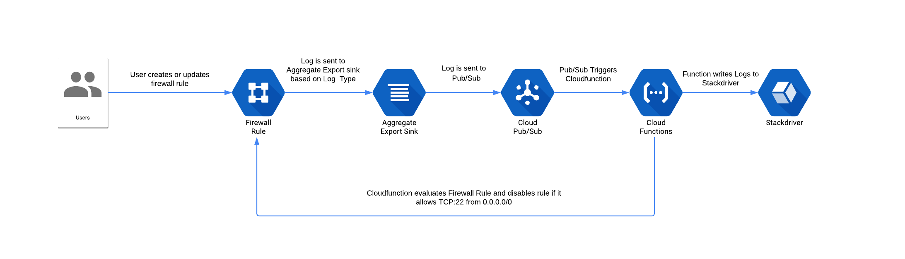
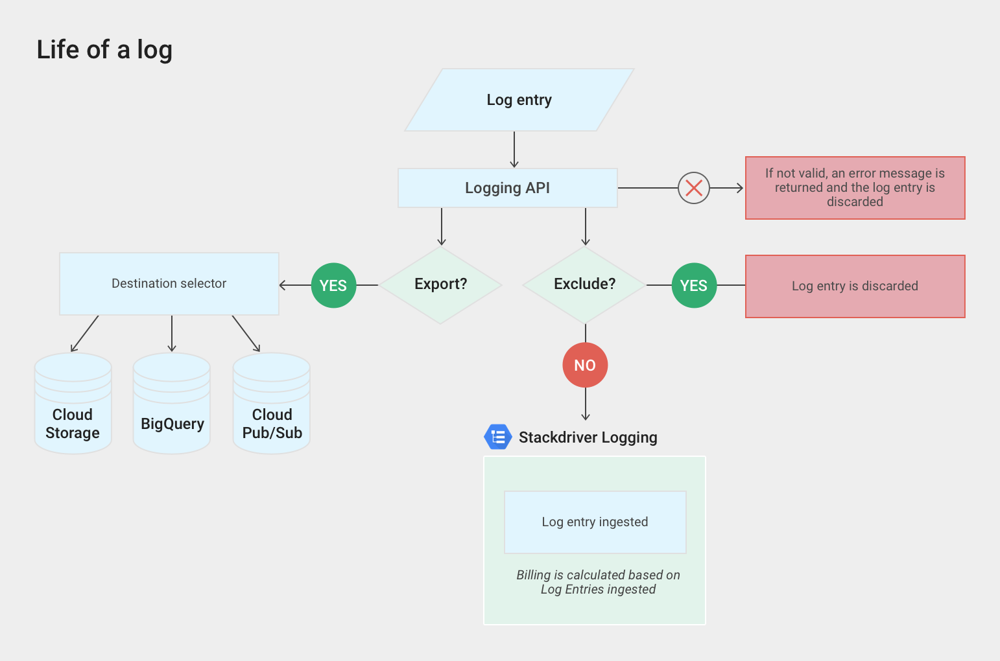

# Terraform - Event Driven Security Demonstration

The Terraform module is used to demonstrate the concepts discussed in [Article](https://medium.com/p/9408929240ea/edit)

## Prerequisites 

The user running terraform must have the following permissions:

At the organization level:
* Organizaton Administrator
* Logging Administrator

At the project level:
* PubSub Administrator
* CloudFunction Administrator
* Storage Administrator

## Usage

1. Clone Repository Locally
```
git clone https://github.com/ScaleSec/terraform-google-firewall-remediation.git
```
2. Change Directory
```
cd terraform-google-firewall-remediation
```
3. Create an terraform.auto.tfvars file - Replace values before running command
```
cat > terraform.auto.tfvars <<EOF
  org_id                       = "<<replace with your org id>>"
  project                      = "<<replace with your project id"
EOF
```

4. Authenticate to Google Cloud using Application Default Credentials
```
gcloud auth application-default login
```

5. Run Terraform

```
terraform init
terraform plan
terraform apply
```

6. Open Cloudshell and create a firewall rule using the command below

```
gcloud compute firewall-rules create demo-rule --direction=INGRESS --priority=1000 --network=$(terraform output network_name) --action=ALLOW --rules=tcp:22 --source-ranges=0.0.0.0/0
```

7. Navigate to the Firewall just created in the [Firewall Rules Page](https://console.cloud.google.com/networking/firewalls/) in the Google Cloud Console and.

8. Validate that the Firewall Rule is diabled

9. Navigate to the [CloudFunctions page](https://console.cloud.google.com/functions/) in the Cloud Console and select the function provisioned in step 5

10.  Click the 'View Logs' Button to view the outputs of the function


## Inputs

| Name | Description | Type | Default | Required |
|------|-------------|:----:|:-----:|:-----:|
| org_id | The ID of the Organization to provision resources | string | - | yes |
| project |The ID of the project where the pub/sub topic will be installed  | string | - | yes |
| region | The location of resources | string | `us-east1` | no |
| name | Prefix for resource naming | string | `eds` | no |
| org_sink_filter | The Log Filter to apply to the Org Level export.  Defaults to all activity logs | string | `logName:logs/compute.googleapis.com%2Factivity_log resource.type:gce_firewall_rule jsonPayload.event_subtype:compute.firewalls.insert jsonPayload.event_type:GCE_API_CALL` | no |

## Outputs

| Name | Description |
|------|-------------|
| topic-name    | The name of the pub/sub topic where logs are sent to |
| project       | The Project which hosts the pubsub topic and subscription resources |
| organization_sink_writer | The Service Account associated with the organization sink.  Ensure this account has publish permissions to a pubsub topic |

## HLD

In this demonstration, we will show how to use CloudFunctions to automatically remediate open firewall rules.

The workflow is as follows:



## Log Evaulation Diagram

The following diagram illustrates how exported log entries are treated in Stackdriver Logging:



Exporting involves writing a filter that selects the log entries you want to export, and choosing a destination in Cloud Storage, BigQuery, or Cloud Pub/Sub. The filter and destination are held in an object called a sink. Sinks can be created in projects, organizations, folders, and billing accounts.
